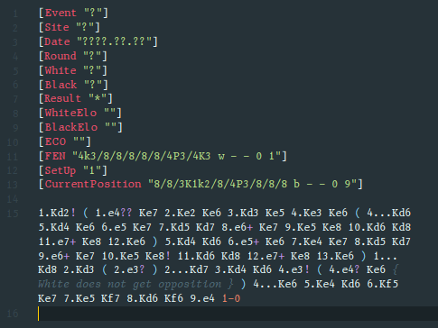

# VS Code PGN

[PGN](https://en.wikipedia.org/wiki/Portable_Game_Notation) ("Portable Game Notation") is a standard for representing chess game data.

## Installation

## Features

- Syntax highlighting
    - Commentary (both end-of-line and brace notation)
    - Variations
    - Tags

- Snippets
    - The mandatory 'Seven Tag Roster' (trigger with `str`)

## License

Licensed under the [MIT License](https//l.shreyasminocha.me/MIT/2020-).
